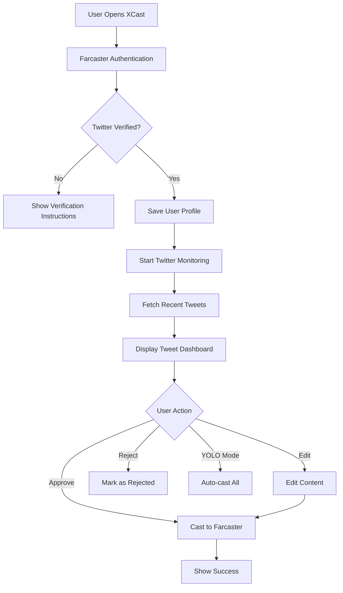

# XCast - Twitter to Farcaster Bridge

[](https://nextjs.org/)
[](https://reactjs.org/)
[](https://www.typescriptlang.org/)
[](https://tailwindcss.com/)

XCast is a powerful Farcaster Mini App that bridges the gap between Twitter and Farcaster, allowing users to seamlessly cross-post their Twitter content to Farcaster. Built with modern web technologies and optimized for mobile-first experiences within Farcaster clients.

## ✨ Features

### 🔗 **Seamless Social Bridge**

- Connect verified Twitter accounts through Farcaster
- Automatic content synchronization between platforms
- One-tap cross-posting with smart content adaptation

### 📱 **Mobile-First Design**

- Optimized for mobile viewing in Farcaster clients
- Responsive UI with Tailwind CSS
- Smooth animations with Framer Motion
- Native mobile experience

### 🔄 **Intelligent Content Management**

- Real-time monitoring of Twitter activity
- Automatic tweet fetching and parsing
- Content preview with edit capabilities
- Smart content filtering and curation

### ✅ **Advanced Control Features**

- **YOLO Mode**: Auto-approve and cast all tweets
- **Selective Casting**: Choose which tweets to cast manually
- **Content Editing**: Modify tweets before casting
- **Status Tracking**: Monitor cast status (pending, approved, cast, failed)

### 💰 **USDC Integration**

- Built-in USDC payment system for casting fees
- Spending limits and approval controls
- Transaction history and balance tracking
- OnchainKit integration for seamless payments

### 🔔 **Smart Notifications**

- Real-time status updates
- Customizable notification preferences
- Success/failure alerts
- Cast confirmation notifications

### 🛡️ **Security & Privacy**

- Secure authentication via Farcaster
- Encrypted token storage
- Rate limiting and abuse prevention
- Privacy-first data handling

## 🚀 Quick Start

### Prerequisites

- **Node.js** 18+ and npm/yarn
- **Farcaster Account** with verified Twitter
- **Supabase Project** (free tier available)
- **Neynar API Key** ([Get one here](https://neynar.com/)).

### 1. Clone & Install

```bash
git clone https://github.com/yourusername/xcast.git
cd xcast
npm install
```

### 2. Environment Configuration

Create a `.env.local` file in your project root:

```bash
# Supabase Configuration
NEXT_PUBLIC_SUPABASE_URL=your_supabase_url_here
NEXT_PUBLIC_SUPABASE_ANON_KEY=your_supabase_anon_key_here
SUPABASE_SERVICE_ROLE_KEY=your_supabase_service_role_key_here

# Neynar API Configuration
NEXT_PUBLIC_NEYNAR_CLIENT_ID=your_neynar_client_id_here
NEYNAR_API_KEY=your_neynar_api_key_here

# Optional: Twitter API (for production usage)
TWITTER_BEARER_TOKEN=your_twitter_bearer_token_here
TWITTER_API_KEY=your_twitter_api_key_here
TWITTER_API_SECRET=your_twitter_api_secret_here

# Redis Configuration (Optional - for caching)
UPSTASH_REDIS_REST_URL=your_redis_url_here
UPSTASH_REDIS_REST_TOKEN=your_redis_token_here
```

### 3. Database Setup

Set up your Supabase database with the required tables:

#### Users Table

```sql
CREATE TABLE users (
  id UUID DEFAULT gen_random_uuid() PRIMARY KEY,
  created_at TIMESTAMP WITH TIME ZONE DEFAULT NOW(),
  updated_at TIMESTAMP WITH TIME ZONE DEFAULT NOW(),
  twitter_id TEXT,
  twitter_username TEXT,
  twitter_display_name TEXT,
  twitter_access_token TEXT,
  twitter_refresh_token TEXT,
  twitter_connected_at TIMESTAMP WITH TIME ZONE,
  farcaster_fid INTEGER UNIQUE,
  farcaster_username TEXT,
  farcaster_display_name TEXT,
  neynar_signer_uuid TEXT,
  farcaster_connected_at TIMESTAMP WITH TIME ZONE,
  yolo_mode BOOLEAN DEFAULT FALSE,
  notifications_enabled BOOLEAN DEFAULT TRUE,
  auto_approve BOOLEAN DEFAULT FALSE,
  usdc_balance NUMERIC DEFAULT 0,
  total_spent NUMERIC DEFAULT 0,
  spending_approved BOOLEAN DEFAULT FALSE,
  spending_limit NUMERIC DEFAULT 0
);

-- Add indexes for performance
CREATE INDEX idx_users_farcaster_fid ON users(farcaster_fid);
CREATE INDEX idx_users_twitter_username ON users(twitter_username);
```

#### Tweets Table

```sql
CREATE TABLE tweets (
  id UUID DEFAULT gen_random_uuid() PRIMARY KEY,
  created_at TIMESTAMP WITH TIME ZONE DEFAULT NOW(),
  updated_at TIMESTAMP WITH TIME ZONE DEFAULT NOW(),
  user_id UUID REFERENCES users(id) ON DELETE CASCADE,
  twitter_id TEXT UNIQUE,
  content TEXT NOT NULL,
  original_content TEXT,
  twitter_url TEXT,
  twitter_created_at TIMESTAMP WITH TIME ZONE,
  cast_status TEXT DEFAULT 'pending' CHECK (cast_status IN ('pending', 'approved', 'rejected', 'cast', 'failed')),
  cast_hash TEXT,
  cast_url TEXT,
  cast_created_at TIMESTAMP WITH TIME ZONE,
  cast_price NUMERIC DEFAULT 0,
  payment_approved BOOLEAN DEFAULT FALSE,
  payment_processed BOOLEAN DEFAULT FALSE,
  is_edited BOOLEAN DEFAULT FALSE,
  edit_count INTEGER DEFAULT 0,
  auto_cast BOOLEAN DEFAULT FALSE
);

-- Add indexes for performance
CREATE INDEX idx_tweets_user_id ON tweets(user_id);
CREATE INDEX idx_tweets_twitter_id ON tweets(twitter_id);
CREATE INDEX idx_tweets_cast_status ON tweets(cast_status);
CREATE INDEX idx_tweets_created_at ON tweets(created_at DESC);
```

### 4. Development

```bash
npm run dev
```

Visit `http://localhost:3000` to see your app running locally..

## 🏗️ Architecture

### Tech Stack

- **Frontend**: Next.js 14, React 18, TypeScript
- **Styling**: Tailwind CSS, Framer Motion
- **Backend**: Next.js API Routes
- **Database**: Supabase (PostgreSQL)
- **Authentication**: Farcaster Frame SDK, Neynar
- **Blockchain**: OnchainKit, Wagmi, Viem
- **State Management**: React Query, SWR
- **Caching**: Upstash Redis (optional)

### Key Dependencies

```json
{
  "@farcaster/frame-sdk": "Frame integration",
  "@neynar/react": "Farcaster API wrapper",
  "@coinbase/onchainkit": "Blockchain utilities",
  "@supabase/supabase-js": "Database client",
  "@tanstack/react-query": "Data fetching",
  "framer-motion": "Animations",
  "lucide-react": "Icons"
}
```

### Project Structure

```
xcast/
├── app/
│   ├── api/                 # API routes
│   │   ├── user/           # User management
│   │   ├── tweets/         # Tweet operations
│   │   ├── twitter/        # Twitter integration
│   │   ├── cast/           # Farcaster casting
│   │   ├── usdc/           # Payment handling
│   │   └── webhook/        # External webhooks
│   ├── components/         # React components
│   │   ├── ui/            # Reusable UI components
│   │   ├── settings/      # Settings components
│   │   ├── approval/      # Tweet approval UI
│   │   └── cast/          # Casting components
│   ├── auth/              # Authentication pages
│   ├── settings/          # Settings pages
│   └── globals.css        # Global styles
├── hooks/                 # Custom React hooks
├── lib/                   # Utility functions
└── public/                # Static assets
```

## 📋 API Reference

### Core Endpoints

#### User Management

- `POST /api/user` - Create/update user profile
- `GET /api/user?fid={fid}` - Get user by Farcaster ID
- `DELETE /api/user` - Delete user account

#### Twitter Integration

- `POST /api/twitter/monitor` - Start monitoring Twitter
- `GET /api/twitter/monitor?userId={id}` - Get monitored tweets
- `POST /api/twitter/verify` - Verify Twitter connection

#### Tweet Operations

- `GET /api/tweets?fid={fid}` - Get user's tweets
- `POST /api/tweets/action` - Approve/reject tweets
- `PUT /api/tweets/{id}` - Edit tweet content
- `DELETE /api/tweets/{id}` - Delete tweet

#### Farcaster Casting

- `POST /api/cast` - Cast to Farcaster
- `GET /api/cast/status/{hash}` - Get cast status

#### USDC Payments

- `POST /api/usdc/approve` - Approve spending
- `GET /api/usdc/balance` - Get balance
- `POST /api/usdc/transaction` - Process payment

## 🔄 User Flow



## 🚀 Deployment

### Vercel (Recommended)

1. **Connect Repository**

   ```bash
   # Deploy directly from GitHub
   vercel --prod
   ```

2. **Environment Variables**

   - Add all `.env.local` variables in Vercel dashboard
   - Ensure `NEXT_PUBLIC_*` variables are properly prefixed

3. **Database Migration**
   - Run SQL scripts in Supabase dashboard
   - Verify table creation and indexes

### Alternative Platforms

- **Netlify**: Use `npm run build` with Next.js plugin
- **Railway**: Direct GitHub integration available
- **DigitalOcean App Platform**: Container deployment

### Production Checklist

- [ ] Environment variables configured
- [ ] Database tables created with indexes
- [ ] Neynar API key activated
- [ ] USDC contract addresses updated
- [ ] Rate limiting configured
- [ ] Error monitoring setup (Sentry recommended)
- [ ] Analytics configured (optional)

## 🛠️ Development

### Local Development

```bash
# Install dependencies
npm install

# Start development server
npm run dev

# Run linting
npm run lint

# Build for production
npm run build
```

### Testing

```bash
# Run type checking
npm run type-check

# Test API endpoints
curl -X GET http://localhost:3000/api/user?fid=123
```

### Code Style

- **ESLint** + **Prettier** for code formatting
- **TypeScript** for type safety
- **Tailwind CSS** for consistent styling
- **React Query** for data fetching patterns

## 🤝 Contributing

We welcome contributions! Please follow these steps:

1. **Fork the repository**
2. **Create a feature branch**
   ```bash
   git checkout -b feature/amazing-feature
   ```
3. **Make your changes**
4. **Add tests if applicable**
5. **Commit with conventional commits**
   ```bash
   git commit -m "feat: add amazing feature"
   ```
6. **Push to your fork**
7. **Create a Pull Request**

### Development Guidelines

- Follow TypeScript best practices
- Use React Query for API calls
- Implement proper error handling
- Add proper TypeScript types
- Write descriptive commit messages
- Update documentation for new features

## 📄 License

This project is licensed under the **MIT License** - see the [LICENSE](LICENSE) file for details.

## 🆘 Support

- **Documentation**: Check this README and inline code comments
- **Issues**: [GitHub Issues](https://github.com/yourusername/xcast/issues)
- **Discussions**: [GitHub Discussions](https://github.com/yourusername/xcast/discussions)
- **Farcaster**: [@xcast](https://warpcast.com/xcast) on Warpcast

## 🎯 Roadmap

- [ ] **Enhanced Content Filtering**: AI-powered content curation
- [ ] **Multi-Platform Support**: Instagram, LinkedIn integration
- [ ] **Advanced Analytics**: Engagement tracking and insights
- [ ] **Scheduled Posting**: Queue tweets for optimal timing
- [ ] **Team Collaboration**: Multi-user account management
- [ ] **Custom Frames**: Branded casting experiences
- [ ] **API Webhooks**: Third-party integrations

---

<div align="center">
  <strong>Built with ❤️ for the Farcaster ecosystem</strong>
</div>

hey
