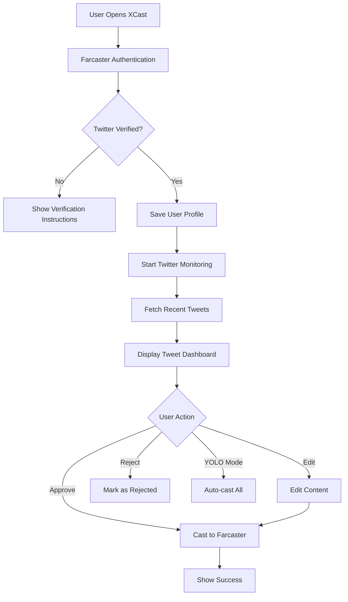

# XCast

[](https://nextjs.org/)
[](https://reactjs.org/)
[](https://www.typescriptlang.org/)
[](https://tailwindcss.com/)

A Farcaster Mini App that enables seamless cross-posting from Twitter to Farcaster. Built with Next.js and optimized for mobile-first experiences within Farcaster clients.

## Features

### Core Functionality

- Cross-post Twitter content to Farcaster with one tap
- Preview and edit tweets before casting
- Thread support with automatic conversion
- Channel selection for targeted casting
- YOLO mode for automatic approval

### Platform Integration

- Farcaster authentication via Mini App SDK
- Neynar API for cast publishing
- Notion integration for Farcaster username mapping
- USDC payment system for casting fees (OnchainKit)

### User Controls

- Manual tweet approval workflow
- Content editing before posting
- Status tracking (pending, approved, cast, failed)
- Notification preferences
- Spending limits and balance management

## Quick Start

### Prerequisites

- Node.js 18+ and npm
- Farcaster account with verified Twitter
- Supabase project (free tier available)
- Neynar API key (get one at [neynar.com](https://neynar.com/))

### Installation

```bash
git clone https://github.com/yourusername/xcast.git
cd xcast
npm install
```

### Environment Setup

Create a `.env.local` file:

```bash
# Supabase
NEXT_PUBLIC_SUPABASE_URL=your_supabase_url
NEXT_PUBLIC_SUPABASE_ANON_KEY=your_supabase_anon_key
SUPABASE_SERVICE_ROLE_KEY=your_supabase_service_role_key

# Neynar
NEXT_PUBLIC_NEYNAR_CLIENT_ID=your_neynar_client_id
NEYNAR_API_KEY=your_neynar_api_key

# Notion (optional - for username mapping)
NOTION_API_KEY=your_notion_api_key
NOTION_DATABASE_ID=your_notion_database_id

# Redis (optional - for caching)
UPSTASH_REDIS_REST_URL=your_redis_url
UPSTASH_REDIS_REST_TOKEN=your_redis_token

# Analytics (optional)
NEXT_PUBLIC_POSTHOG_KEY=your_posthog_key
NEXT_PUBLIC_POSTHOG_HOST=your_posthog_host
```

### Database Setup

Run these SQL commands in your Supabase SQL editor:

```sql
-- Users table
CREATE TABLE users (
  id UUID DEFAULT gen_random_uuid() PRIMARY KEY,
  created_at TIMESTAMP WITH TIME ZONE DEFAULT NOW(),
  updated_at TIMESTAMP WITH TIME ZONE DEFAULT NOW(),
  farcaster_fid INTEGER UNIQUE,
  farcaster_username TEXT,
  farcaster_display_name TEXT,
  neynar_signer_uuid TEXT,
  yolo_mode BOOLEAN DEFAULT FALSE,
  notifications_enabled BOOLEAN DEFAULT TRUE,
  spending_approved BOOLEAN DEFAULT FALSE,
  spending_limit NUMERIC DEFAULT 0
);

CREATE INDEX idx_users_farcaster_fid ON users(farcaster_fid);

-- Tweets table
CREATE TABLE tweets (
  id UUID DEFAULT gen_random_uuid() PRIMARY KEY,
  created_at TIMESTAMP WITH TIME ZONE DEFAULT NOW(),
  updated_at TIMESTAMP WITH TIME ZONE DEFAULT NOW(),
  user_id UUID REFERENCES users(id) ON DELETE CASCADE,
  twitter_id TEXT UNIQUE,
  content TEXT NOT NULL,
  original_content TEXT,
  twitter_url TEXT,
  twitter_created_at TIMESTAMP WITH TIME ZONE,
  cast_status TEXT DEFAULT 'pending',
  cast_hash TEXT,
  cast_url TEXT,
  cast_created_at TIMESTAMP WITH TIME ZONE,
  is_edited BOOLEAN DEFAULT FALSE,
  auto_cast BOOLEAN DEFAULT FALSE
);

CREATE INDEX idx_tweets_user_id ON tweets(user_id);
CREATE INDEX idx_tweets_cast_status ON tweets(cast_status);
```

### Development

```bash
npm run dev
```

Open `http://localhost:3000` in your browser.

## Tech Stack

- **Framework**: Next.js 14 with App Router
- **Language**: TypeScript
- **Styling**: Tailwind CSS
- **Database**: Supabase (PostgreSQL)
- **Authentication**: Farcaster Mini App SDK
- **Farcaster API**: Neynar SDK
- **Blockchain**: OnchainKit, Wagmi, Viem
- **State Management**: React Query, SWR
- **Animation**: Framer Motion
- **Analytics**: PostHog
- **Monitoring**: Sentry

### Project Structure

```
xcast/
├── app/
│   ├── api/                 # API routes
│   │   ├── user/           # User management
│   │   ├── tweets/         # Tweet operations
│   │   ├── twitter/        # Twitter integration
│   │   ├── cast/           # Farcaster casting
│   │   ├── usdc/           # Payment handling
│   │   └── webhook/        # External webhooks
│   ├── components/         # React components
│   │   ├── ui/            # Reusable UI components
│   │   ├── settings/      # Settings components
│   │   ├── approval/      # Tweet approval UI
│   │   └── cast/          # Casting components
│   ├── auth/              # Authentication pages
│   ├── settings/          # Settings pages
│   └── globals.css        # Global styles
├── hooks/                 # Custom React hooks
├── lib/                   # Utility functions
└── public/                # Static assets
```

## 📋 API Reference

### Core Endpoints

#### User Management

- `POST /api/user` - Create/update user profile
- `GET /api/user?fid={fid}` - Get user by Farcaster ID
- `DELETE /api/user` - Delete user account

#### Twitter Integration

- `POST /api/twitter/monitor` - Start monitoring Twitter
- `GET /api/twitter/monitor?userId={id}` - Get monitored tweets
- `POST /api/twitter/verify` - Verify Twitter connection

#### Tweet Operations

- `GET /api/tweets?fid={fid}` - Get user's tweets
- `POST /api/tweets/action` - Approve/reject tweets
- `PUT /api/tweets/{id}` - Edit tweet content
- `DELETE /api/tweets/{id}` - Delete tweet

#### Farcaster Casting

- `POST /api/cast` - Cast to Farcaster
- `GET /api/cast/status/{hash}` - Get cast status

#### USDC Payments

- `POST /api/usdc/approve` - Approve spending
- `GET /api/usdc/balance` - Get balance
- `POST /api/usdc/transaction` - Process payment

## 🔄 User Flow



## 🚀 Deployment

### Vercel (Recommended)

1. **Connect Repository**

   ```bash
   # Deploy directly from GitHub
   vercel --prod
   ```

2. **Environment Variables**

   - Add all `.env.local` variables in Vercel dashboard
   - Ensure `NEXT_PUBLIC_*` variables are properly prefixed

3. **Database Migration**
   - Run SQL scripts in Supabase dashboard
   - Verify table creation and indexes

### Alternative Platforms

- **Netlify**: Use `npm run build` with Next.js plugin
- **Railway**: Direct GitHub integration available
- **DigitalOcean App Platform**: Container deployment

### Production Checklist

- [ ] Environment variables configured
- [ ] Database tables created with indexes
- [ ] Neynar API key activated
- [ ] USDC contract addresses updated
- [ ] Rate limiting configured
- [ ] Error monitoring setup (Sentry recommended)
- [ ] Analytics configured (optional)

## 🛠️ Development

### Local Development

```bash
# Install dependencies
npm install

# Start development server
npm run dev

# Run linting
npm run lint

# Build for production
npm run build
```

### Testing

```bash
# Run type checking
npm run type-check

# Test API endpoints
curl -X GET http://localhost:3000/api/user?fid=123
```

### Code Style

- **ESLint** + **Prettier** for code formatting
- **TypeScript** for type safety
- **Tailwind CSS** for consistent styling
- **React Query** for data fetching patterns

## 🤝 Contributing

We welcome contributions! Please follow these steps-

1. **Fork the repository**
2. **Create a feature branch**
   ```bash
   git checkout -b feature/amazing-feature
   ```
3. **Make your changes**
4. **Add tests if applicable**
5. **Commit with conventional commits**
   ```bash
   git commit -m "feat: add amazing feature"
   ```
6. **Push to your fork**
7. **Create a Pull Request**

### Development Guidelines

- Follow TypeScript best practices
- Use React Query for API calls
- Implement proper error handling
- Add proper TypeScript types
- Write descriptive commit messages
- Update documentation for new features

## 📄 License

This project is licensed under the **MIT License** - see the [LICENSE](LICENSE) file for details.

## 🆘 Support

- **Documentation**: Check this README and inline code comments
- **Issues**: [GitHub Issues](https://github.com/yourusername/xcast/issues)
- **Discussions**: [GitHub Discussions](https://github.com/yourusername/xcast/discussions)
- **Farcaster**: [@xcast](https://warpcast.com/xcast) on Warpcast

## 🎯 Roadmap

- [ ] **Enhanced Content Filtering**: AI-powered content curation
- [ ] **Multi-Platform Support**: Instagram, LinkedIn integration
- [ ] **Advanced Analytics**: Engagement tracking and insights
- [ ] **Scheduled Posting**: Queue tweets for optimal timing
- [ ] **Team Collaboration**: Multi-user account management
- [ ] **Custom Frames**: Branded casting experiences
- [ ] **API Webhooks**: Third-party integrations

---
